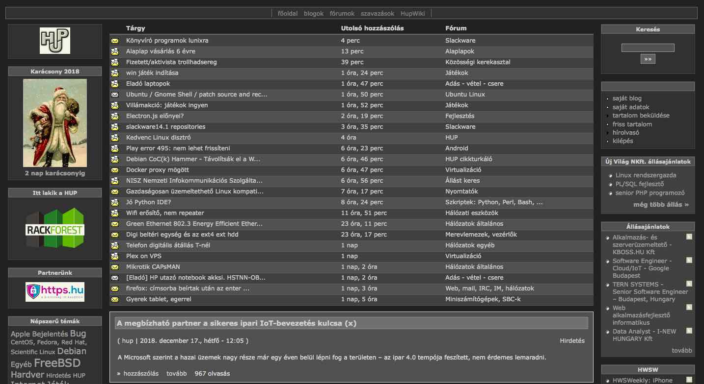
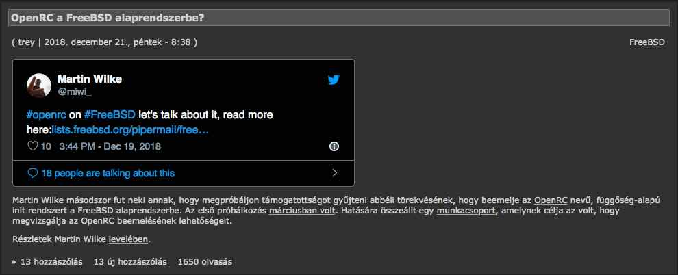
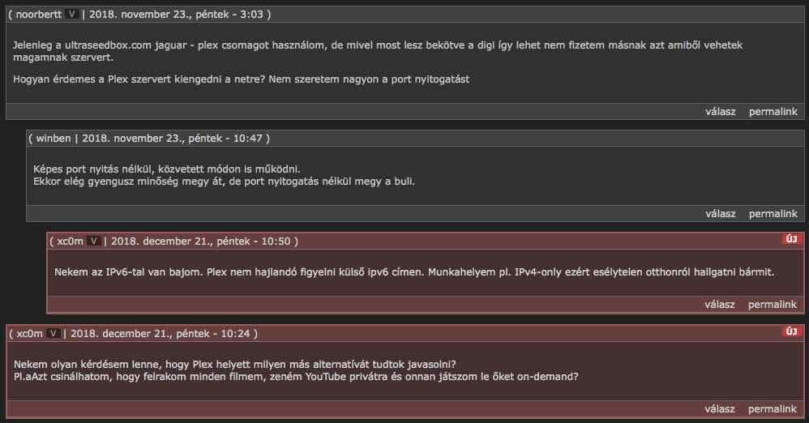

# darkHUP 

A **darkHUP** egy `user.js` script mely a https://hup.hu weboldal kinézetét változtatja
sötét témájúva, továbbá jobb kiemelést biztosít az új hozzászólások megjelenítéséhez.

A script helyes működése érdekében **run-at**: `document-body` módban kell futnia
(https://tampermonkey.net). Ebben az esetben képes a beágyazott twitter blokkok témáját
is sötét színekben megjelenítenie.

### main page

### dark twitter

### new comments

